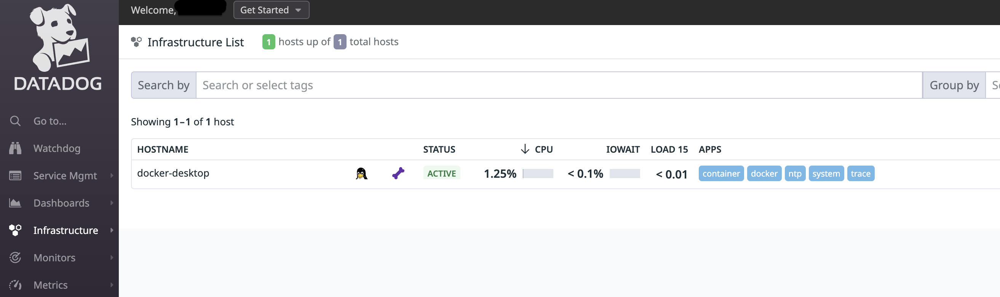

# [Golang] slogを使ってDatadogにログを送ってみる
## 目次
- 本記事でやること
- 対象読者
- 使用言語とライブラリー
- 背景
- 環境構築
  - Datadogのアカウント作成
  - Datadog-AgentをDockerで起動
  - DatadogのWEB UIからAgentが起動していることを確認
  - アプリケーションのDockerコンテナな起動
- slogでログを送る
  - Datadogのログを確認する
  - log.Printfでログを送った時の違い
- トレースをDataDogに送る
  - Datadogのトレースを確認する
- ログとトレースの接続
  - withでtrace_idをinjectするように実装する
  - handlerでtrace_idをinjectするように実装する
- まとめ

## 本記事でやること
- Datadog-AgentのDockerコンテナを起動する
- ログ収集対象のアプリケーションのDockerコンテナを起動する
- slogを用いてDataDogにログを送る
- トレースをDataDogに送る
- ログにトレースIDを付与する

今回実装したコードはこちらのレポジトリで公開しております。

## 対象読者
- (難しいことは一旦置いておいて)Datadogを触ってみたい方
- slogを使ってみたい方

## 使用言語
- Go言語 1.21.0

## 背景
log/slog(以下slog)はGo1.21から標準ライブラリに含まれるようになった構造化ロギングパッケージです。
構造化ログギングには3rdパーティライブラリを利用するケースが多く、slogへの置き換えも積極的には行われていないように感じます。
しかし、今後アプリケーションを開発する上で標準ライブラリであるslogを選択していくことは、アプリケーションのメンテナンス性を高める上で非常に重要なことだと考えています。
また、今後の業務に活かすことを考え、Datadogを用いながらslogを利用する方法をまとめました。


## 環境構築

### Datadog-AgentをDockerで起動
DockerでDatadog-Agentを起動します。今回は監視対象のアプリケーションもDockerコンテナで起動するため、Docker Composeを利用します。
まずは以下docker-compose.ymlを作成します。

```yml:docker-compose.yml
version: "3"
services:
  datadog-agent:
    container_name: datadog-agent
    image: gcr.io/datadoghq/agent:latest
    pid: host
    environment:
      - DD_API_KEY=<YOUR_API_KEY>
      - DD_SITE=ap1.datadoghq.com
      - DD_APM_NON_LOCAL_TRAFFIC=true
      - DD_APM_ENABLED=true
      - DD_LOGS_ENABLED=true
      - DD_LOGS_CONFIG_CONTAINER_COLLECT_ALL=true
      - DD_AC_EXCLUDE=name:datadog
      - DD_LOGS_CONFIG_USE_HTTP=true
    volumes:
      - /var/run/docker.sock:/var/run/docker.sock
      - /proc/:/host/proc/:ro
      - /sys/fs/cgroup:/host/sys/fs/cgroup:ro
      - /var/lib/docker/containers:/var/lib/docker/containers:ro
    ports:
        - "8126:8126/tcp"
        - "8125:8125/udp"
```

以下を実行し、Datadog-Agentのコンテナを起動します。
```bash
$ docker compose build --no-cache
$ docker compose up -d
$ docker compose ps
datadog-agent       "/bin/entrypoint.sh"   datadog-agent       running (healthy)   0.0.0.0:8125->8125/udp, :::8125->8125/udp, 0.0.0.0:8126->8126/tcp, :::8126->8126/tcp
```
無事Dockerコンテナが起動したことが確認できたら、DatadogのWEB UIからAgentが起動していることを確認します。
WEBUIにログインし、左メニューの「Infrastructure」を選択し、「docker-desktop」がAciiveになっていることが確認できればOKです。



### アプリケーションのDockerコンテナな起動

Datadog-AgentのDockerコンテナが起動できたら、次は監視対象のアプリケーションのDockerコンテナを起動します。
今回は簡略化のため、以下のような"Hello World"を返すだけのHTTPサーバーを作成します。
また、[こちら](https://docs.datadoghq.com/ja/tracing/trace_collection/library_config/go/)の公式ドキュメントを参考にトレーシングライブラリーを利用し、APMデータを収集できるようにします。

```go:main.go
package main

import (
	"log"
	"net/http"

	httptrace "gopkg.in/DataDog/dd-trace-go.v1/contrib/net/http"
	"gopkg.in/DataDog/dd-trace-go.v1/ddtrace/tracer"
)

func main() {

	tracer.Start(
		tracer.WithService("sample-service"),
		tracer.WithEnv("dev"),
		tracer.WithDebugMode(true),
	)
	defer tracer.Stop()

	// Create a traced mux router
	mux := httptrace.NewServeMux()
	
	// Continue using the router as you normally would.
	mux.HandleFunc("/", func(w http.ResponseWriter, r *http.Request) {
		w.Write([]byte("Hello World!!!\n"))
	})
	if err := http.ListenAndServe(":8080", mux); err != nil {
		log.Fatal(err)
	}
}
```

次に、Dockerfileを作成します。また、今回は開発効率を考えairを利用してホットリロードできるようにしています。

```Dockerfile:Dockerfile
FROM golang:1.21.0

WORKDIR /home/go-slog-datadog

COPY go.mod go.sum ./
RUN go mod download

COPY . .
RUN go build -o main .

ENV DD_TRACE_SAMPLE_RATE 1

RUN go install github.com/cosmtrek/air@latest

CMD ["air", "-c", ".air.toml"]
```

これで、アプリケーションとDatadog-AgentのDockerコンテナを起動する準備が整いました。
docker-compose.yamlにアプリケーションのDockerコンテナを追加します。

```yml:docker-compose.yml
version: "3"
services:
  app:
    container_name: app
    build:
        context: .
        dockerfile: Dockerfile
    ports:
      - "8080:8080"
    environment:
      - DD_SERVICE=sample-service
      - DD_ENV=dev
      - DD_VERSION=0.0.1
      - DD_AGENT_HOST=datadog-agent
    volumes:
      - .:/home/go-slog-datadog
    depends_on:
      - datadog-agent

  datadog-agent:
    ...(省略)
```


## slogでログを送る
log/slog(以下slog)はGo1.21から標準ライブラリに含まれるようになった構造化ロギングパッケージです。
今回はslogの内部構造に関する詳細は他の文献に任せ、各種メソッドを利用しDatadog上に出力されるログを確認しながらslogの外観を確認していきます。

```go:main.go

```
